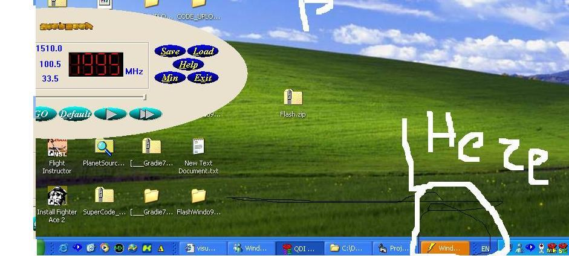



## FlashWindow\-gibreel

### Description

My code flases the windowon the taskbar and the window.It makes it activate/deactivate continiously.
 
### More Info
 
You can set the time between flasing

when window is minimized and it flases the shape on the taskbar changes color.

             |
---                |---
**Submitted On**   |2002-06-24 12:37:00
**By**             |[Gibreel George GR](https://github.com/Planet-Source-Code/PSCIndex/blob/master/ByAuthor/gibreel-george-gr.md)
**Level**          |Beginner
**User Rating**    |4.7 (14 globes from 3 users)
**Compatibility**  |VB 4\.0 \(16\-bit\), VB 4\.0 \(32\-bit\), VB 5\.0, VB 6\.0
**Category**       |[Windows API Call/ Explanation](https://github.com/Planet-Source-Code/PSCIndex/blob/master/ByCategory/windows-api-call-explanation__1-39.md)
**World**          |[Visual Basic](https://github.com/Planet-Source-Code/PSCIndex/blob/master/ByWorld/visual-basic.md)
**Archive File**   |[FlashWindo980896242002\.zip](https://github.com/Planet-Source-Code/gibreel-george-gr-flashwindow-gibreel__1-36205/archive/master.zip)

